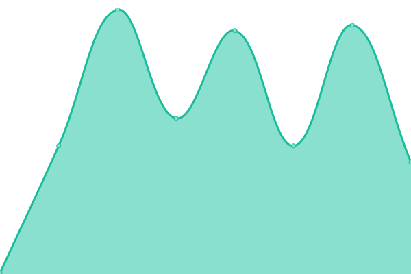
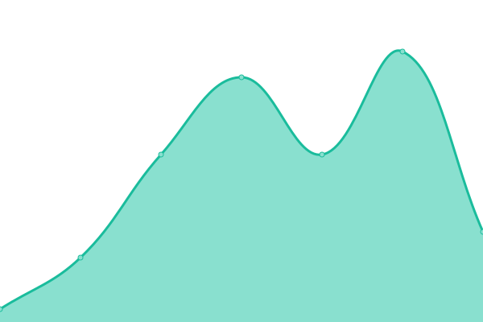
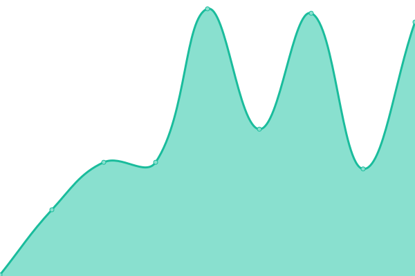
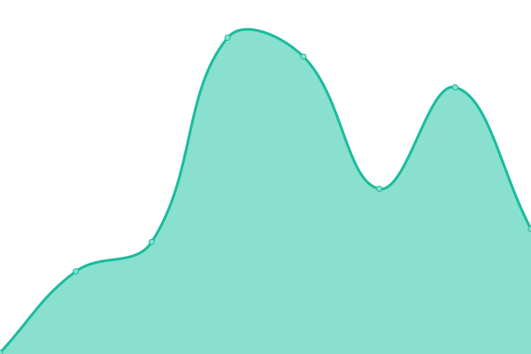

# [📈 Live Status](https://Western-Formula-Racing.github.io/daq-uptime): <!--live status--> **🟩 All systems operational**

This repository contains the open-source uptime monitor and status page for [Western Formula Racing](https://Western-Formula-Racing.github.io/daq-uptime), powered by [Upptime](https://github.com/upptime/upptime).

With [Upptime](https://upptime.js.org), you can get your own unlimited and free uptime monitor and status page, powered entirely by a GitHub repository. We use [Issues](https://github.com/Western-Formula-Racing/daq-uptime/issues) as incident reports, [Actions](https://github.com/Western-Formula-Racing/daq-uptime/actions) as uptime monitors, and [Pages](https://Western-Formula-Racing.github.io/daq-uptime) for the status page.

<!--start: status pages-->
<!-- This summary is generated by Upptime (https://github.com/upptime/upptime) -->
<!-- Do not edit this manually, your changes will be overwritten -->
<!-- prettier-ignore -->
| URL | Status | History | Response Time | Uptime |
| --- | ------ | ------- | ------------- | ------ |
|  [Data Downloader API](https://api.westernformularacing.org/api/health) | 🟩 Up | [data-downloader-api.yml](https://github.com/Western-Formula-Racing/daq-uptime/commits/HEAD/history/data-downloader-api.yml) | 

 0ms
     
 | 

<a href="https://Western-Formula-Racing.github.io/daq-uptime/history/data-downloader-api">0.00%</a>
    

|  [TimescaleDB](https://api.westernformularacing.org/api/health-status) | 🟩 Up | [timescale-db.yml](https://github.com/Western-Formula-Racing/daq-uptime/commits/HEAD/history/timescale-db.yml) | 

 0ms
     
 | 

<a href="https://Western-Formula-Racing.github.io/daq-uptime/history/timescale-db">3.17%</a>
    

|  [Data Uploader](https://uploader.westernformularacing.org/health) | 🟩 Up | [data-uploader.yml](https://github.com/Western-Formula-Racing/daq-uptime/commits/HEAD/history/data-uploader.yml) | 

 0ms
     
 | 

<a href="https://Western-Formula-Racing.github.io/daq-uptime/history/data-uploader">0.00%</a>
    

|  [Code-Server](https://vscode.westernformularacing.org/) | 🟩 Up | [code-server.yml](https://github.com/Western-Formula-Racing/daq-uptime/commits/HEAD/history/code-server.yml) | 

 0ms
     
 | 

<a href="https://Western-Formula-Racing.github.io/daq-uptime/history/code-server">0.40%</a>
    

<!--end: status pages-->

[**Visit our status website →**](https://Western-Formula-Racing.github.io/daq-uptime)

## 📄 License

- Powered by: [Upptime](https://github.com/upptime/upptime)
- Code: [MIT](./LICENSE) © [Anand Chowdhary](https://anandchowdhary.com), supported by [Pabio](https://pabio.com)
- Data in the `./history` directory: [Open Database License](https://opendatacommons.org/licenses/odbl/1-0/)
